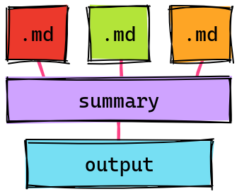

# Introduction

[](https://github.com/abhinav/stitchmd/actions/workflows/ci.yml)

stitchmd is a tool that stitches together several Markdown files
into one large Markdown file,
making it easier to maintain larger Markdown files.

It lets you define the layout of your final document in a **summary file**,
which it then uses to stitch and interlink other Markdown files with.



See [Getting Started](start.md) for a tutorial,
or [Usage](usage.md) to start using it.

## Features

- **Cross-linking**:
  Recognizes cross-links between files and their headers
  and re-targets them for their new locations.
  This keeps your input and output files
  independently browsable on websites like GitHub.

    <details>
    <summary>Example</summary>

    **Input**

    ```markdown
    [Install](install.md) the program.
    See also, [Overview](#overview).
    ```

    **Output**

    ```markdown
    [Install](#install) the program.
    See also, [Overview](#overview).
    ```

    </details>

- **Relative linking**:
  Rewrites relative images and links to match their new location.

    <details>
    <summary>Example</summary>

    **Input**

    ```markdown
    
    ```

    **Output**

    ```markdown
    
    ```

    </details>

- **Header offsetting**:
  Adjusts levels of all headings in included Markdown files
  based on the hierarchy in the summary file.

    <details>
    <summary>Example</summary>

    **Input**

    ```markdown
    - [Introduction](intro.md)
      - [Installation](install.md)
    ```

    **Output**

    ```markdown
    # Introduction

    <!-- contents of intro.md -->

    ## Installation

    <!-- contents of install.md -->
    ```

    </details>


## Use cases

The following is a non-exhaustive list of use cases
where stitchmd may come in handy.

- Maintaining a document with several collaborators
  with reduced risk of merge conflicts.
- Divvying up a document between collaborators by ownership areas.
  Owners will work inside the documents or directories assigned to them.
- Keeping a single-page and multi-page version of the same content.
- Re-using documentation across multiple Markdown documents.
- Preparing initial drafts of long-form content
  from an outline of smaller texts.

...and more.
(Feel free to contribute a PR with your use case.)
